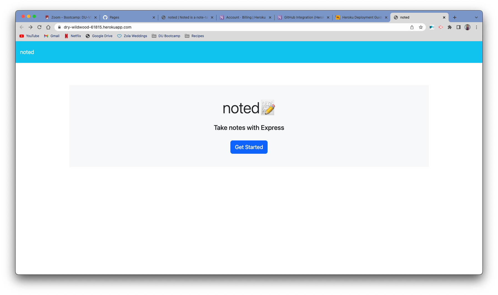
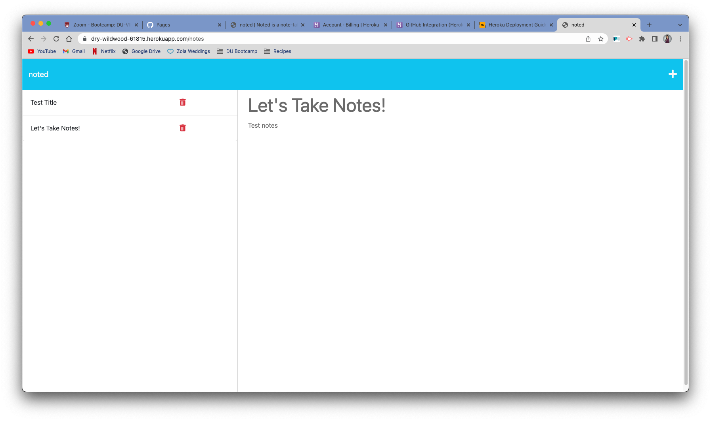

# noted []
  
  ## Description
  Noted is a note taking app using Express.js that allows the user to add new notes, view old ones, and  delete notes. This app:

  - Integrates the front and back end using the server.js
  - Shows usage of fetch, get and delete calls to the database
  - Properly logs unique ids to each note when saved

  As my first project using a server, I was surprised that I was able to successfully complete the project (albeit with a few headaches). While I'm sure real-world servers are infinitely more complicated, this app was a nice introduction to the back-end world of servers. 
  
  ## Table of Contents
   - [Installation](#installation)
   - [Usage](#usage)
   - [Contribution](#contribution)
   - [Testing](#testing)
   - [License](#license)
   - [Questions](#questions)

  ## Installation
  To install dependencies and run this application, please pass the following code in the command line of the application:

  ~~~
  npm i
  ~~~

  To run the application:

  ~~~
  npm start
  ~~~

  ## Usage
  This application is deployed using Heroku. With installation, user will install express and dotenv.

  
  

  ## Contribution
  NA

  ## Testing
  To test, please pass the following code in the command line of the application:

  ~~~
  NA
  ~~~

  ## License
  
  This project uses the MIT license.

  ## Questions
  If you have any questions, please visit my GitHub or email me:
  - GitHub profile: https://github.com/ecussler
  - Email: cusslere@gmail.com
  
